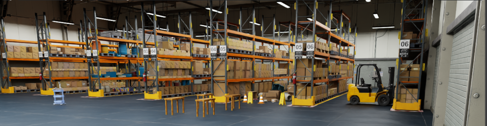
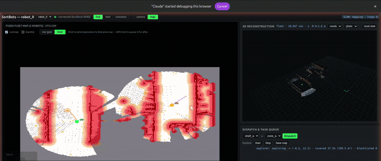

# SortBots




Fully autonomous mobile robots performing collaborative
indoor logistics, built on
[XLeRobot](https://github.com/Vector-Wangel/XLeRobot).

Unlike commercial AMR
systems that rely on extensive per-facility infrastructure,
SortBots targets the opposite operating point: rapid deployment
in unmapped environments, with collaboration as the primary
mechanism for both efficiency and resilience. Robots divide work via decentralized task allocation,
coordinate passage through shared spaces, and dynamically
re-allocate tasks when one is blocked or delayed. Applications to autonomous delivery logistics in dynamic enviornemnts, such as warehouses, shelf restocking, or serving foods in restaurants.

## Exploration Demo

Fleet exploration mapping timelapse - understanding a fresh warehouse enviornment.



Full-quality version: [`docs/media/fleet_explore_timelapse.mp4`](docs/media/fleet_explore_timelapse.mp4).

### Simulation infrastructure
- **Isaac Sim** Isaac Sim 5.1 supporting SLAM pipelines and integrating with Nvidia packages such as Nvblox
- **ManiSkill (arm-manipulation sim):** XLeRobot's original sim env with extensive support for training manipulation tasks

### Perception & mapping
- **Intended sensor suite**
  - Intel RealSense D435 RGB-Depth Camera
  - MPU 6050 IMU
  - Optical Tracking Odometry Sensor - PAA5160E1
- **RGB-D SLAM:** RTAB-Map per robot; dynamic depth filter keeps movers out of the permanent grid
- **Fleet fusion (not collab SLAM):** fused 2D `/map` + fused 3D `/fleet/recon_cloud` via spawn anchors
- **Exploration:** frontier explorer on the fused map; mesh intent/status radio (no peer TF oracle)
- **Dashboard:** live view, fleet radio monitor tab, scenarios console


## Docs

- [`docs/setup.md`](docs/setup.md) — full setup: Isaac Sim + ROS 2 + RTAB-Map (optional ManiSkill at the end)
- [`docs/running.md`](docs/running.md) — running everything: the demo, console mode and scenarios, autonomous exploration, map lifecycle, remote access, dashboard tests
- [`docs/perception_exploration.md`](docs/perception_exploration.md) — perception, exploration, fleet mesh radio, and map/recon fusion architecture


## Run commands

Open a fresh shell at the repo root. Never activate both simulators in the same shell, and never source ROS 2 in either.


### Isaac Sim (mobile / multi-robot / ROS 2 / VSLAM track)

Two ways in. **Console mode** is the one to use day to day — you start the
dashboard once and launch runs from the browser (including from your phone):

```bash
./scripts/run_console.sh       # dashboard only; leave this terminal running
```

Then open <http://localhost:8081/> (or the tailnet URL it prints), switch the
header to **scenarios**, pick one and hit **Start**. That launches Isaac Sim +
RTAB-Map + Nav2 + the task manager for you and streams the launcher's output
into the tab; **Stop** tears the run down and leaves the dashboard up, ready
for the next one. Scenarios are presets in
[`configs/scenarios/`](configs/scenarios/) — today `explore_fresh` (map from
scratch, autonomous frontier exploration) and `explore_resume` (extend the map
a previous run built). Adding one is a YAML file; see
[`docs/running.md`](docs/running.md#adding-a-scenario).

```bash
./scripts/run_console.sh stop  # console + any running sim
```

Scriptable equivalent, for automation or a coding agent —
`scripts/sim_ctl.sh {console start|list|dry-run|start|wait|status|log|stop}`,
with exit codes as the interface:

```bash
./scripts/sim_ctl.sh console start
./scripts/sim_ctl.sh start explore_fresh headless=true
./scripts/sim_ctl.sh wait running --timeout 420
./scripts/sim_ctl.sh stop
```

**Or drive it from the CLI**, unchanged:

```bash
./scripts/run_demo.sh          # launch the whole demo
./scripts/run_demo.sh --explore  # ...and explore autonomously
./scripts/run_demo.sh stop     # shut it all down
```

`run_demo.sh` brings up the entire pipeline in one command. Drive the robot around and the map fills in live. Re-running it resets the environment. The first run auto-builds the robot USD and streams the NVIDIA warehouse (a few minutes; cached after).

Without a console running, the scenarios tab is read-only: it lists what exists
and says how to start the console, rather than offering buttons that can't work.

### ManiSkill (arm manipulation track)

```bash
conda activate lerobot
bash scripts/verify_sim.sh         # smoke test: SAPIEN windows for Fetch + XLeRobot
python scripts/run_xle_demo.py     # XLeRobot demo
```

More detail: [`docs/running.md`](docs/running.md).


## License

Project code: see `LICENSE` (to be added). 

XLeRobot submodule: Apache 2.0 (see `third_party/XLeRobot/LICENSE`).
