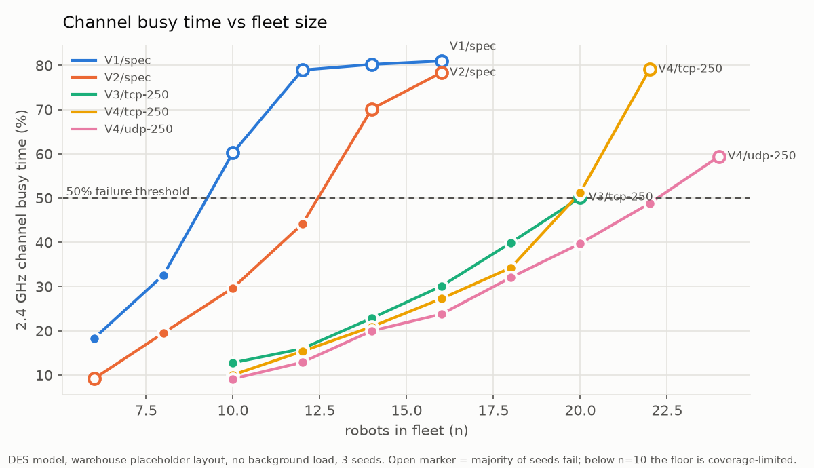
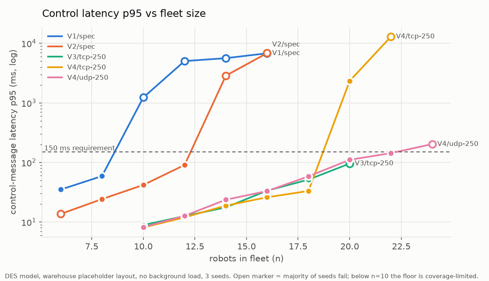
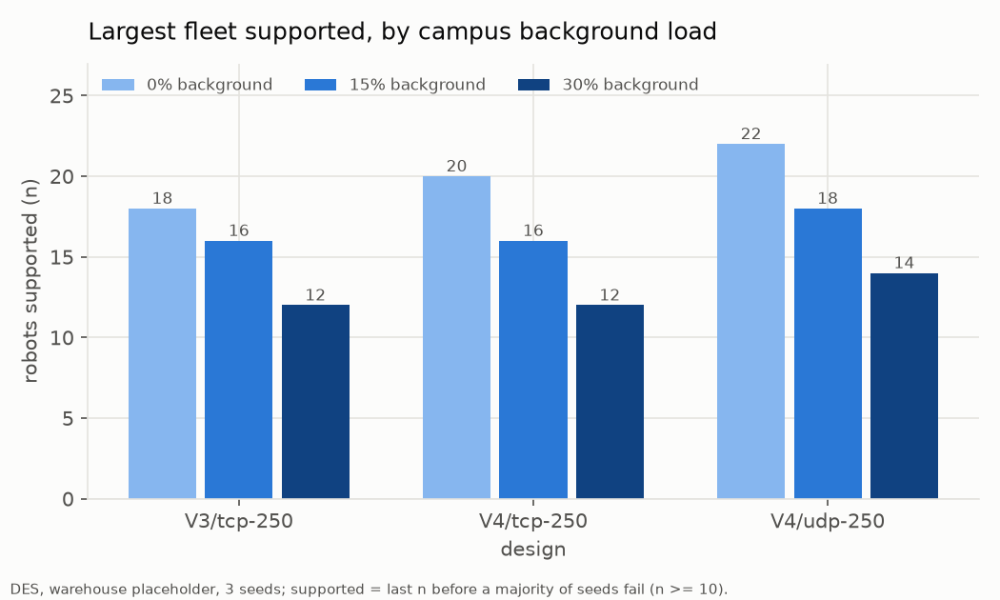
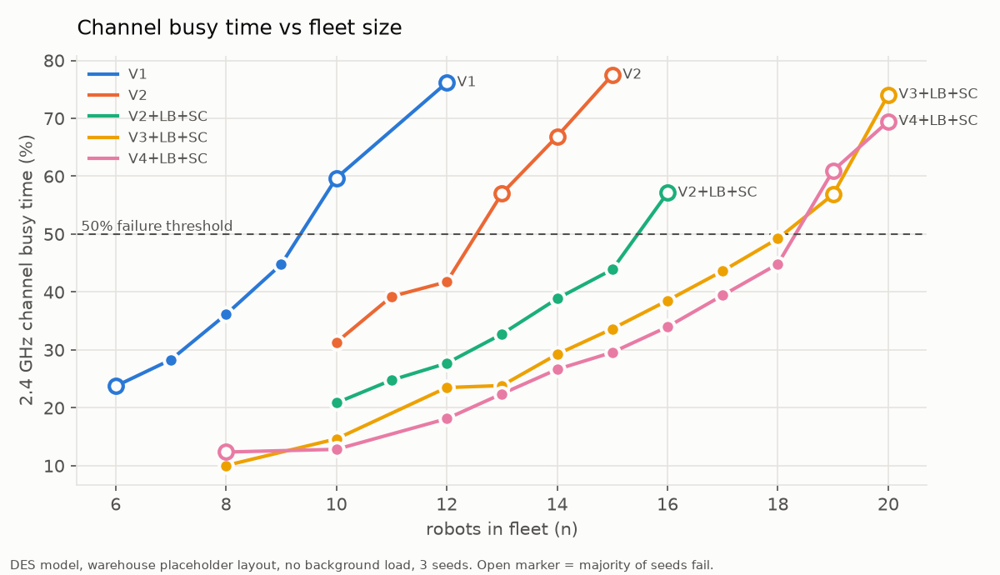
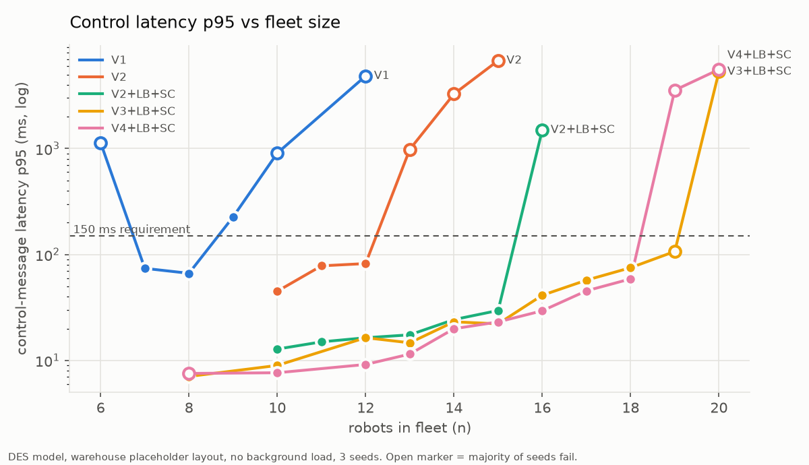
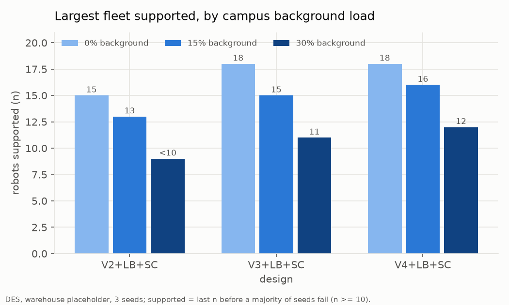

# commsim — fleet communication simulation: results and run log

## Results

### What was tested
The SortBots fleet communication design (from [`brief.md`](brief.md)):
robots coordinate with no central coordinator over a 2.4 + 5 GHz Wi-Fi mesh
(802.11s links, batman-adv routing), Zenoh middleware (`rmw_zenoh`), and a
decentralized auction + lease protocol for task ownership. A gateway with
an operator GUI only injects tasks and shows status.

Two ways of testing, cross-checked against each other:
- **Emulation (real software):** in an Ubuntu 24.04 VM, each robot runs in
  its own network namespace with the real 802.11s, batman-adv, zenohd and
  ROS 2 stacks over simulated radios (`mac80211_hwsim` + `wmediumd`). Used
  for fleets of 3–20 nodes and to measure reroute times, per-message
  overhead and latency.
- **Discrete-event model (DES):** a Python model of the radio channel
  (CSMA/CA), batman-adv routing, Zenoh-over-TCP sessions, and the real
  task-allocation code running in every robot. Used to sweep fleet size until
  failure and to run the failure scenarios. Calibrated against the
  emulation: median latency within 3–10%, tail latency within ~10–30% (the
  model is pessimistic), busy time within ~6% at matched link rates, and
  both put the overload cliff in the same place.

**Pass/fail criteria** (applied to every run): channel busy time ≤ 50% on
any band; control-message latency p95 ≤ 150 ms and p99 ≤ 500 ms; Status
delivery ≥ 95%; no healthy robot wrongly declared "silent"; no duplicate or
abandoned task ownership; auctions complete within 1.5 s (p95); robots'
copies of the map no more than 2 updates behind. A fleet size "fails" when
most of its 3 random seeds break any of these; "supports N" below means N
is the largest size tested before that happens.

**Important caveats** — read before using any number below:
- **No real hardware has been measured yet.** Rack attenuation (industry
  guidance only), path loss, link rates and router behavior are
  placeholders until the 2-robot lab testbed measures them.
- The floor is a generic **placeholder warehouse** (50 × 32 m, 5 rows of
  loaded steel racks), not your lab or a real site.
- **Link rate is the biggest unknown:** at the slow rates the emulated radios
  chose (9–24 Mb/s), the overload cliff came about 3 robots earlier than
  with the faster rates assumed in the tables below.

### The answers
**1. Does the design work as originally written? No.** The intended
design (V3/V4, neighbor-only Status) failed at every fleet size tested, and
the simpler all-to-all versions worked only up to 8 (V1) and 12 (V2)
robots. Four problems, none of them about raw capacity:
| problem found | effect | fix (now the default) |
|---|---|---|
| Task leases were renewed only by Status, but neighbor-only Status never reaches robots outside the owner's area | those robots reclaim tasks still being carried → two robots on one task, from 10 robots up | **LeaseBeacon**: owners announce their tasks fleet-wide once a second |
| Both Zenoh routers of every robot pair dial each other | two TCP sessions per pair, one idling on keepalives → **a third to a half of the airtime wasted** (emulation at 10 robots: 31% → 21% busy; model: about half) | only the lower robot ID dials |
| Status timeout 3 s vs. a rerouting mesh | one broken link → Status gap of 3.5–4 s → healthy robots declared silent | status timeout **6 s**, Zenoh lease **4 s** |
| Status subscriber queue depth 1 ("newest wins") | **15% of Status lost** even on a clean link (measured) | depth 32 |
Testing also found three protocol bugs that are now fixed: a robot could
win and "own" more tasks than it can carry (and never work the extra
ones); a burst of new tasks caused a bid storm (now ≤ 3 open bids per
robot, and a robot withdraws its other bids when it wins one); and an
isolated robot's "am I connected?" check needed to use real receptions.

**2. How many robots does it support (fixed design)?**
Largest fleet before most seeds fail (DES, placeholder warehouse, sizes
tested in steps of 2):
| design | no campus Wi-Fi | 15% campus background | 30% campus background |
|---|---|---|---|
| V4 — neighbor-only Status, dual band (**recommended**) | **22** | **18** | **14** |
| V3 — neighbor-only Status, 2.4 GHz only | 20 | not determined* | 12 |
| V2 — Status to every robot | 16 | – | – |
| V2 as originally written | 12 | – | – |
| V1 naive (separate messages to everyone) | 8 | – | – |
| V3 / V4 as originally written | **0** (lease bug) | – | – |
(*the sweep stopped at 10 robots: two seeds drove into coverage holes,
which is a coverage failure, not a capacity one.) V3/V4 numbers assume each
robot knows which robots listen to its area (see **Still open**); today
Status goes to every robot, which caps at the V2 row. Below ~10 robots
the racked floor itself is the limit: too few robots to relay around the
racks. The first limit to
trip is always **channel airtime**; latency stays well inside its limit
until busy time passes ~50%, then collapses within one or two added robots
(a cliff, not a slope). With Status over TCP instead of UDP each number is
about 2 lower.

**3. Does it survive link and node failures?** 11 failure scenarios
(link loss, 2.4 GHz-only link loss, degraded link, flapping link, relay
robot dies, robot isolated, band loss, network partition, gateway loss,
reboot, 30-task burst) on V3 and V4 at 10 and 15 robots, 3 seeds each —
120 runs (band-only scenarios run on dual-band V4 only), using the worst
measured reroute times. A separate negative control (status timeout
deliberately set below the reroute time) confirms the checks catch false
"silent" decisions; it is not counted below.
Each run is judged by the scenario's own pass condition from the plan:
e.g. a link loss must reroute without any robot being declared silent; a
dead or isolated robot's task must be reclaimed only after lease + margin;
a burst must not starve control traffic.
| configuration | runs passed |
|---|---|
| as originally written | 18 / 120 |
| fixed, Status over TCP, batman OGM 500 ms | 71 / 120 |
| fixed, Status over TCP, OGM 250 ms | 100 / 120 |
| **fixed, Status over UDP, OGM 250 ms (current default)** | **110 / 120** |
What holds: an isolated robot always stops before others reclaim its task
(~10 s vs ~12.5 s); a dead robot's task is reclaimed only after lease +
margin; robots keep working when the gateway is down and its view rebuilds
in ~2–3 s; rebooted robots rejoin in ~2 s; a 30-task burst completes with
control latency under 40 ms. What still fails: **losing the 2.4 GHz band is
a full outage** (5 GHz alone cannot cover a racked floor), and **during a
network split both halves may work the same task** (accepted by design; it
resolves within ~2 s of the split healing in most runs).

**4. Timing requirements (measured on the real stack in emulation):**
| quantity | measured | limit / design value |
|---|---|---|
| Status latency, 1–2 hops | p50 2.4 ms, p95 4.3 ms | p95 ≤ 150 ms |
| batman reroute, equally short detour | 1.95 s | — |
| batman reroute, longer detour | 10.3 s @ OGM 1000 ms · 5.7 s @ 500 ms · **3.0 s @ 250 ms** | must stay below status timeout |
| worst Status gap after a link loss (UDP, OGM 250 ms) | 3.0 s | status timeout 6 s |
| Status delivery through a link loss | 98.7% | ≥ 95% |
| memory / CPU per emulated robot node | ~82 MB / ~4–7% | — |
The required order now holds with margin: **reroute (≤ 3.0 s) < Zenoh
lease (4 s) < status timeout (6 s) < task lease (10 s)**, and the config
generator refuses settings that break it.

**5. Which design choices matter most?** In order of effect:
1. one TCP session per robot pair (a third to a half of the airtime);
2. neighbor-only Status (V3/V4) — but only together with the lease beacon;
3. Status over UDP instead of TCP (+2 robots, far better under overload:
   89% vs 35% delivered at 15 robots in emulation, and no TCP retry backoff
   after a reroute);
4. batman OGM interval 250 ms (reroutes 3 s instead of 5.7 s; costs ≤ 2
   robots of capacity);
5. dual band (V4): small gain on a clean channel, the biggest gain under
   campus interference (14 vs 12 robots at 30% background).
Not worth pursuing in a racked layout: **one-hop Status broadcast (phases
3–4, V5/V6)** — it reaches only ~75–82% of the neighbors that need it; and
**a single access point (phase 0)** — only ~55% of robot pairs can reach
each other.

### Recommended configuration (now the defaults in `configs/base.yaml`)
V4 dual-band mesh · batman-adv OGM 250 ms · 802.11b rates off, multicast
12 Mb/s · Zenoh routers: lower ID dials, lease 4 s, explicit peers, no
multicast scouting, no shared memory · **Status over UDP** (port 7450,
bound to the mesh address only), status timeout 6 s, queue depth 32 ·
LeaseBeacon 1 Hz · task lease 10 s + 2 s reclaim margin · at most 3 open
bids per robot. `configs/spec_original.yaml` restores the original design
for comparison.

### For the 2-robot + gateway demo
Capacity is not a concern (~1% channel busy, 2–5 ms latency, measured on
this exact 3-node setup). The risks are **coverage** and **antenna
placement**: walk the demo route first, mount the gateway antenna high and
central, keep each robot's antenna vertical and above its metal frame.
**Router minimum:** runs stock OpenWrt; two radios working at the same time
(2.4 + 5 GHz); 802.11s mesh on both radios (MediaTek mt76 or Qualcomm
ath9k/ath10k chipsets; avoid Broadcom); batman-adv packages; ≥ 16 MB flash /
≥ 128 MB RAM; at least one Ethernet port for the Jetson; 2×2 MIMO 802.11n or
newer; can run from robot power. **Antenna minimum:** ordinary 2–3 dBi
dual-band omni dipoles are enough at lab scale — placement matters more
than gain (`Step 23` has the link-budget table).

### Still open
- Measure on the real router: link rate and loss vs distance through the
  shelving, and reroute time when a link is pulled (replaces the biggest
  placeholders).
- Neighbor-only Status over UDP needs a small "which cells I listen to"
  announcement before scaling past ~10 robots (currently Status goes to
  every robot, which is right for 2).
- Decide whether duplicate work during a network split is acceptable long
  term, and whether a 2.4 GHz outage needs a fallback.

### Where the details are
Everything below this section is the chronological run log (what was done,
why, and what came out, including mistakes and how they were found). Key
steps: 6–9 emulation measurements · 16–17 fixes and bugs found · 18 reroute
by OGM interval · 20 final comparison · 22 UDP Status · 23 link budget ·
24 code review fixes. Reproduce: `commsim/scripts/fix_sweep.sh` (DES),
`commsim/emu/*.py` (emulation, inside the VM), raw results in
`commsim/results/` (gitignored). Steps 13–15 predate fixes to the model
and are superseded by step 20.

---

# Run log (chronological)

Running log of what was done, why, and what came out. Until the lab testbed
(M5) replaces the placeholders in `configs/base.yaml`, every result here is
a *model* result, not a measurement of the real fleet.

## 2026-10-03 — session 1

### Starting state
- VM `commsim` exists (multipass, Ubuntu 24.04.5, kernel 6.8.0-142-generic,
  12 vCPU, 9.7 GiB), repo mounted at `~/SortBots`. Not yet provisioned: no
  ROS, no Mininet-WiFi, and `mac80211_hwsim` missing (needs
  `linux-modules-extra`).
- No Isaac session running (`sim_ctl.sh status` exit 3), so no RAM contention.
- Passwordless sudo works inside the VM (`sudo -n true`); host sudo is not used.

### Step 1 — provision the VM
Why: the emulation (real 802.11s + batman-adv + zenohd per robot) needs
hwsim, batman-adv, Mininet-WiFi/wmediumd and ROS 2 Jazzy with rmw_zenoh.
Ran `sudo ./commsim/vm/provision_vm.sh` inside the VM.
Result: exit 0. `hwsim radios: OK`, batctl/batman-adv 2024.0, ROS 2 Jazzy
(ros-base, rmw_zenoh_cpp, rmw_cyclonedds_cpp), Mininet-WiFi 2.7 + wmediumd.
Mininet-WiFi is still on `master` (pin after M0 passes).

### Step 2 — build the scale model (DES) first
Why: with 9.7 GiB the VM can hold roughly 10–15 emulated robots (plan
estimate), and the failure points the plan asks for are likely above that.
The DES is what reaches failure; the emulation calibrates it at small n.

Built `commsim/des/` (radio.py, layout.py, sim.py, run.py):
- Medium: slotted CSMA/CA per band — DIFS, frozen backoff counters, CW
  doubling, 7 retries, ACK timing, 802.11n HT timing **without A-MPDU**.
  **One contention domain per band** (everyone defers to everyone): overstates
  contention on a big floor, hides hidden terminals.
- Routing: batman-like best-TQ path from OGM loss + hop penalty; OGM airtime
  charged (aggregated, 24 B per originator per node per interval per band).
- Middleware: zenohd full mesh of TCP sessions (explicit connect to every
  peer), one copy per subscriber, cwnd 10, delayed ACK, RTO retransmit,
  in-order delivery, keepalive on idle sessions (lease/4), best-effort drop
  when backlog > 32.
- App: the real `core.protocol.Allocator` in every robot; Poisson tasks
  (1 per robot per 200 s, PLACEHOLDER), aisle-following motion at 0.5 m/s,
  obstacles 0.02/s per robot, map patches 3 KB every 2–5 s to neighbors.
- Layout: generic PLACEHOLDER warehouse 50 × 32 m, 5 rack rows, 3 m aisles
  (the real floor plan is open question 2). Rack attenuation 10 dB/crossing is
  **hypothetical** (no cited figure yet).

Medium sanity checks (`commsim/tests/des_test.py`, all pass):
- Airtime arithmetic matches hand calculation (100 B @ MCS0 = 214 µs).
- 1 saturated sender, 1500 B @ 65 Mbps → 32.5 Mbps goodput = textbook DCF
  without aggregation (370 µs/frame). My first expectation (~45) wrongly
  assumed A-MPDU.
- Collision share rises with contenders (2 → 5%, 10 → 17%).
- Background interferer realizes its target share (30% ± 4%).

### Design findings while modeling (before any sweep)
These come from reading the spec into code, not from a run:
1. **V3 neighbor-only Status breaks lease renewal.** Leases are renewed only
   by Status, and V3 sends Status only to neighbor cells, so robots outside
   the owner's neighborhood never see a renewal → lease expires at them →
   they rebid and claim a task that is still being carried. The DES models
   this faithfully; a fix variant adds a fleet-wide `LeaseBeacon` (owned task
   list only, low rate).
2. **"Isolated = heard no peer" misfires under V3.** A robot with no
   neighbors hears no Status at all. The DES therefore also feeds transport
   liveness (zenoh sessions alive) to the allocator (`heard_network`);
   `--no-transport-liveness` reproduces the spec-literal behavior.
3. Auction time is only counted for tasks where an idle robot was in bid
   radius at announce; otherwise it measures fleet capacity, not comms.
4. Duplicate ownership is counted when it persists across two 1 Hz samples
   (≥ 1 s, proposed threshold); sub-second claim races are reported
   separately as `dup_transient`.

DES run length: 20 s warm-up + 60 s steady (plan said 60 + 300 for
emulation); a length-sensitivity check follows.

### Step 3 — first runs exposed three model bugs (fixed before sweeping)
First n=20 runs (V1/V2/V3) all failed, so I added an airtime breakdown by
traffic type before believing anything:
1. **Fixed 200 ms TCP RTO → spurious-retransmission storm.** Instrumented:
   8,704 of 11,279 retransmissions were for segments already delivered (ACK
   just late under queueing). Real Linux adapts RTO (SRTT + 4·RTTVAR, floor
   200 ms, Karn's rule). Fixed; V3 n=20 p95 went 7.2 s → 120 ms on the seed
   that had collapsed.
2. **No ACK piggybacking.** Added: a pending ACK rides on the next reverse
   segment of the same session.
3. **Map patches sent to every robot in V1/V2.** Spec says MapUpdate goes to
   region subscribers in every design; V1/V2 differ in status only. Map
   fragments were 43% of V2's airtime. Fixed: maps are region-scoped in all
   variants.
4. Stragglers: a Status in flight when a robot unsubscribed restarted silence
   tracking → spurious "silent". Now such Status renews leases only.

After fixes, n = 15, seed 1: V1 busy 86% (fails everything), V2 34% (passes),
V3 29% (fails only `ownership` — the lease bug, finding 1).

**Airtime finding (model, needs emulation confirmation):** in V3 the payload
is the minority of airtime. n=15: TCP ACKs 36%, Status 25%, zenoh keepalives
17%, map 17%, OGMs 3%. Two design choices drive this:
- every tiny Status is its own TCP segment and gets its own ACK frame;
- the short zenoh lease (2 s, forced by the timer ordering) means keepalives
  every 0.5 s on each of the n(n+1) full-mesh sessions that are otherwise idle.
Both are directly measurable with tcpdump in the emulation (M1) — top
calibration priority.

### Step 4 — first spec-faithful DES sweep (pre-calibration; superseded by step 7)
`des.run --until-fail`, 3 seeds, warehouse, no background load:
- V1 fails at n=15 (n=10: 31% busy, passes). V2 fails at n=20 (n=15: 32%,
  passes) — a cliff, not a slope: 32% → 86% busy between 15 and 20.
- V3, V4, V5, V6 and phase0 fail at **n=10** — the smallest n swept — every
  seed on `ownership` (the lease bug, finding 1). V5/V6 also on
  `status_delivery`.

### Step 5 — rack attenuation: cited values replace the hypothetical 10 dB
Searched for published figures. Only integrator/vendor guidance found (not
peer-reviewed): 15–20 dB through 20-ft steel racks
(https://www.2mtechnology.net/unifi-warehouse-wifi-design/), 15–25 dB per
row, 5 GHz worse than 2.4 (https://www.purple.ai/en-us/guides/why-5ghz-is-faster-but-2-4ghz-is-more-reliable).
Baseline now 15 dB @ 2.4 GHz, 20 dB @ 5 GHz. Caution: industrial-hall
measurements report near free-space path loss (arXiv:1906.12145), so the
path-loss exponent 3.0 may be pessimistic → sensitivity run at 2.0.
Added a connectivity metric (`conn_frac`: share of node pairs with a route).
Finding: **small fleets are coverage-limited** on this floor — n=2–5 runs had
conn 0.33–0.99 (robots behind racks with nobody to relay); n=10 had 1.000
everywhere. Scale sweeps therefore start at n=10, coverage is swept apart.

### Step 6 — emulation M0 and M1 (real stack, in the VM)
Built `commsim/emu/mesh.py` (hwsim radios in namespaces, real 802.11s with
mesh_fwding 0, batman-adv IV at 500 ms OGM, wmediumd SNR matrix — driven
directly, not via Mininet-WiFi) and `commsim/emu/m1.py` (rmw_zenohd per
namespace with the fleet-generated ZENOH_CONFIG_OVERRIDE + rclpy Status stub
at 3 Hz, tcpdump on the gateway's bat0).

**M0 passes:** 3-node line, n0 → n2 via n1 (2 batman hops), 20/20 pings,
RTT avg 3.1 ms, TQ 253/197. Note: ARP/translation-table needs > 15 s after
bring-up; the first ping attempt failed only because of that.

**M1 (3-node line, Status 3 Hz all-to-all, 90 s):**
| | depth 1 | depth 10 |
|---|---|---|
| samples | 1026 | 1244 |
| latency p50 / p95 / p99 | 3.7 / 5.1 / 6.0 ms | 4.2 / 6.6 / 7.6 ms |
| delivery | **0.85** | **1.00** |
- 1-hop p50/p95 3.89/5.67 ms; 2-hop 4.89/7.21 ms → ~2.9 ms fixed stack
  delay + ~1.0 ms per hop (per-hop includes wmediumd userspace forwarding).
- Status CDR = 64 B (144 B with 10 waypoints); TCP payload 136 B → **72 B
  zenoh + rmw_zenoh overhead per message** (DES had guessed 54).
- **0.91 pure TCP ACKs per data segment** — confirms the DES's ACK-per-Status.
- 82 MB RSS and 3.6% CPU per emulated node → the VM's RAM is not the cap.

Emulation findings (real software, not model):
5. **KEEP_LAST(1) loses other robots' Status.** "Best-effort, newest wins"
   as depth 1 on a shared topic dropped 15% of statuses — the queue is per
   subscription, not per publisher. Depth 10: 100%. Spec needs depth ≥
   publishers per topic, or per-robot status keys.
6. **Two TCP sessions per pair.** Both routers `connect` to each other (as
   the spec says), so each pair holds two sessions; one carries data, the
   other idles on keepalives: gateway↔robot 2 idle session = 333 keepalives
   + 177 ACKs in 90 s (~6 frames/s per pair, for nothing). Fix: only the
   lower id dials (`--single-connect` in the DES).
7. rmw_zenoh's default transport lease is 60 s (keep_alive 2). The design's
   timer ordering needs < 3 s, so the 2 s lease and its keepalive load are a
   cost of the design, not of zenoh defaults.

### Step 7 — DES recalibrated from M1, cross-checked
Applied: 72 B per-message overhead, measured CDR sizes, stack delay 2.4 ms +
Exp(0.7 ms), 0.75 ms per-hop processing, duplicate idle session per pair.
`python3 -m commsim.des.crosscheck` (DES reproducing the M1 setup):
| metric | emulation | DES |
|---|---|---|
| 1-hop p50 / p95 | 3.89 / 5.67 ms | 3.99 / 5.78 ms |
| 2-hop p50 / p95 | 4.89 / 7.21 ms | 4.84 / 6.61 ms |
| delivery | 1.00 | 1.00 |
| pure ACKs per data segment | 0.91 | 1.00 |
Within plan tolerance (±20% p95) at n=3. This only validates the stack
model at low load — contention at large n is still unvalidated (needs a
larger emulated fleet; next).
Pre-calibration sweep results were moved to `results/old_*_precal`.

### Step 8 — emulation at n=10 (warehouse SNR matrix), and two emulation bugs
Status-only, 3 Hz all-to-all, 10 nodes, wmediumd SNR matrix from the DES
propagation model (same placeholders). Each run 120 s, ~25,000 latency samples.
| run | busy | p50 / p95 / p99 | delivery |
|---|---|---|---|
| a. 11b rates ON (bug) | 36.6% | 11.1 / 24.5 / 33.2 ms | 0.998 |
| b. 11b off, wmediumd interference OFF (bug) | 26.2% | 4.6 / 10.0 / 14.9 ms | 0.999 |
| c. 11b off, interference ON (correct) | 30.9% | 7.1 / 15.0 / 27.2 ms | 0.999 |
- (a) `mesh.py` never applied the design's "legacy 802.11b rates off";
  minstrel sent ~40% of frames at 5.5/1 Mb/s. Fixed (`iw set bitrates`).
- (b) wmediumd's `enable_interference` was off, so stations never deferred
  to each other — latency understated. Fixed (now on by default).
- Busy time is computed from a capture on `hwsim0` (every frame on the air,
  incl. ACKs) with the DES's own 802.11 timing.
- hwsim's rate control lands on **legacy 9–24 Mb/s**, not HT MCS.

DES on the same SNR matrix (`python3 -m commsim.des.crosscheck n10`):
| | emulation (c) | DES legacy rates | DES HT rates |
|---|---|---|---|
| busy | 30.9% | 18.6% | 21.6% |
| p50 / p95 / p99 | 7.1 / 15.0 / 27.2 | 6.5 / 20.0 / 33.9 | 6.8 / 22.6 / 37.6 ms |
Latency agrees within ~10% (p50) and ~30% (tail). Busy time is ~40% lower
in the DES: the emulation's rate control picks slower rates than the DES's
SNR thresholds. **Link rate is the biggest unresolved lever** — the lab's
throughput-vs-distance measurement fixes it. Bracketed below with a
legacy-rate sensitivity sweep.

### Step 9 — reroute time measured; link loss breaks the timer budget
`commsim/emu/reroute.py`: diamond 0-(1|2)-3, ping every 10 ms, block the
active first hop with `iw ... plink_action block` (spec's method).
- OGM 500 ms: outage **1.92–1.98 s** (6 trials, median 1.95 s).
- OGM 250 ms: **1.94 s** (4 trials) — not OGM-bound in this emulation, so
  halving the OGM interval buys nothing here (hardware may differ).
Same diamond with the full stack (zenohd + Status stubs), link blocked at
t=30 s: max Status gap 0→3 = **3.71 s** (lease 2 s) / **3.48 s** (lease 4 s);
the 3-hop detour pair saw 5–7 s. Zenoh sessions did not drop.
Finding 8: **reroute + TCP retransmission backoff > status timeout.**
Segments lost in the 1.95 s outage are retried at ~0.2/0.6/1.4/3.0 s, so
Status resumes ~3–3.7 s after the break — past the 3 s status timeout. A
single link loss makes healthy robots look silent. The spec's ordering
(reroute < zenoh lease < status timeout) is not enough: the status timeout
must also exceed reroute + one TCP backoff step (≈ 2 × reroute).

### Step 10 — calibrated scale sweeps (DES, warehouse, HT rates, 3 seeds)
Variants: spec-faithful; `+LB` = fleet-wide lease beacon 1 Hz (fix for
finding 1); `+SC` = single TCP session per pair (fix for finding 6).
Largest n where all seeds pass / first n where seeds fail; first criterion:
| design | bg 0% | bg 15% | bg 30% | first criterion |
|---|---|---|---|---|
| V1 spec | (see step 12) / 10 | | | busy |
| V2 spec | (see step 12) / 15 | | | busy |
| V3–V6, phase0 spec | — / fail at 10 | | | ownership (lease bug) |
| V2+LB+SC | 14 / 15 | 12 / 14 | coverage / 6 | busy |
| V3+LB | 12 / 13 | | | busy |
| V3+LB+SC | 17 / 18 | 10 / 12 | coverage / 6 | busy |
| V4+LB | 13 / 14 | | | busy |
| V4+LB+SC | 18 / 19 | 14 / 16 | 10 / 12 | busy |
| V5/V6 +LB(+SC) | — / fail at 10 | | | status_delivery |
| phase0 | — / fail at 10 | | | coverage (conn 0.53) |
- **Airtime is the bottleneck for every design that survives the protocol
  bugs**; latency only fails after busy > 50%, and then collapses (a cliff:
  44% → 60–70% busy by adding one robot; queues + TCP retransmissions).
- **Single TCP session per pair is the biggest single gain** (V3: 13 → 18
  robots; halves airtime at n=10: 27% → 14%).
- **Dual band (V4) adds ~1 robot without interference but holds up under
  campus load** (bg 30%: V4 survives to 10 vs V3/V2 failing at 6). 5 GHz is
  under-used (2–8% busy): with 20 dB/rack it rarely wins batman's TQ
  comparison, so traffic stays on 2.4 GHz. A throughput-aware metric or
  explicit band steering would use it better.
- **V5/V6 one-hop status broadcast fails status delivery (~0.75) at every
  n in the warehouse**: neighbor-cell subscribers (up to ~28 m, behind
  racks) are often not one radio hop away. On an open floor V5/V6 pass to
  n=15 and fail at 20 (broadcasts have no MAC retries).
- **Phase 0 (single AP) fails on coverage**: only 53–56% of node pairs can
  reach each other through one AP in a racked floor.
- Sensitivity: path-loss exponent 2.0 (industrial-hall measurements) moves
  V4+LB+SC from failing at 19–20 to failing at 25.
Below n≈8 the warehouse is coverage-limited (conn < 1), so failures there
are coverage, not scale.

### Step 11 — why the DES under-counted airtime vs emulation (n=10)
Frame rates agree (emulation 1,457 data frames/s, DES ~1,600 tx/s); the gap
is airtime per frame: emulation 212 µs vs DES 133 µs. Under wmediumd
interference the emulation's minstrel falls back to 9–24 Mb/s legacy rates.
- A "legacy rates" DES run was *faster* than HT (short legacy preamble +
  lower SNR thresholds) — so it did not bracket the emulation. Replaced by a
  rate cap: DES capped at 12 Mb/s legacy reproduces the emulation point:
  busy 29.1% vs 30.9%, p50 7.9 vs 7.1 ms (p95 29 vs 15 ms — the DES's
  single contention domain makes tails ~2× pessimistic).
- Used as the pessimistic bracket ("/slow"): V2+LB+SC fails at 12, V3 at
  15, V4 at 18 (pre-session-fix code; final numbers in step 13).

### Step 12 — DES model bug: zenoh sessions never closed
The first full scenario pass showed 40–60 s Status gaps — longer than any
reroute. Cause: the DES's TCP never gave up, so a receiver could wait behind
a lost sequence number indefinitely; real zenoh closes a session after one
transport lease of silence and re-dials. Fixed: lease-expiry close of both
directions, epoch numbers so stale segments/ACKs are ignored, re-dial every
1 s (PLACEHOLDER) once a route exists. After the fix: link loss gap 4.0 s in
the DES (emulation 3.5–3.7 s, session did not drop there — DES slightly
pessimistic), gateway view rebuilt 2.7 s after return, healed-partition
duplicates resolved in 2.1–2.2 s. The invalid run is kept in
`results/old_S_scen_T3_stuck_sessions` for reference.
Scenario judging corrections: silence between robots left with no route is
correct, not false (relay-death partitions); "robots continue existing
tasks" during gateway loss = no forced stops (30 s is too short for tasks to
complete); reboot rejoin is measured at the gateway (always subscribed).
Because steps 10–11 ran on the pre-fix DES, the headline sweep was re-run on
the final code: `commsim/scripts/final_sweep.sh` (step 13).

### Step 13 — headline results (final code, `scripts/final_sweep.sh`)
DES, placeholder warehouse (50 × 32 m, 5 rack rows), HT rates, 3 seeds per
point, 20 s warm-up + 60 s steady. "Supports" = last n before a majority of
seeds fail; below n = 10 the floor is coverage-limited (open markers at
n = 6–8 in the charts are coverage dropouts, not load).
Raw rows: `results/FINAL/runs.jsonl`, `results/FINAL_bg/runs.jsonl`.

| design | supports (bg 0 / 15 / 30%) | first criterion to trip | busy at n=10 | p95 at n=10 |
|---|---|---|---|---|
| V1 naive (spec) | 8 / – / – | busy > 50% | 60% | 905 ms |
| V2 bundled (spec) | 12 / – / – | busy > 50% | 31% | 45 ms |
| V3, V4 (spec) | fails at 10 | ownership (lease bug) | 24–25% | 40 ms |
| V5, V6 (spec) | fails at 10 | status delivery + ownership | 22–23% | 23–29 ms |
| phase 0 single AP (spec) | fails at 10 | coverage (54% of pairs reachable) | 9% | 15 ms |
| V2 +LB+SC | 15 / 13 / <10 | busy > 50% | 21% | 13 ms |
| V3 +LB | 13 | busy > 50% | 26% | 30 ms |
| V3 +LB+SC | 18 / 15 / 11 | busy > 50% | 15% | 9 ms |
| V4 +LB | 12–14 | busy > 50% | 23% | 27 ms |
| V4 +LB+SC | 18 / 16 / 12 | busy > 50% | 13% | 8 ms |
| V5/V6 +LB+SC | fails at 10 | status delivery (0.75–0.82) | 12% | 4–5 ms |
Sensitivity on V4+LB+SC: emulation-like slow rates (≤12 Mb/s legacy) → 15
(V3: 14, V2: coverage-limited at 8); near-free-space path loss (exponent
2.0) → 22.
Hand estimates in the brief (V1 50% near 11, V2 near 19, V3 ~14% at 20) vs
model: V1 crosses 50% at ~9–10, V2 (spec, both sessions) at ~12–13, V3+LB+SC
is ~50% at 18 — the brief's estimates were optimistic, mainly because they
did not count TCP ACKs, zenoh keepalives on n² sessions, and the 72 B
per-message overhead.
Expected shape: V1 grows fastest (≈ n²: 24% → 76% from n=6 to 12); V3/V4
grow slower but still super-linearly because the n² session keepalives and
OGMs scale with the fleet, not with neighbors.

### Step 14 — failure scenarios (DES, V3/V4 +LB+SC, n = 10 and 15, 3 seeds)
Injection at t = 40 s, measured to t = 100 s; reroute 1.95 s (measured).
Pass counts out of 6 runs per row (2 fleet sizes × 3 seeds), per timer set:
| scenario | spec timers (lease 2 s, status 3 s) V3 / V4 | status 5 s V3 / V4 | lease 4 s + status 6 s V3 / V4 |
|---|---|---|---|
| single link loss (both bands) | 0 / 0 | 4 / 5 | 4 / 6 |
| link loss, 2.4 GHz only | – / 0 | – / 4 | – / 6 |
| degraded link | 5 / 6 | 6 / 6 | 6 / 6 |
| link flapping (2 s) | 0 / 0 | 5 / 3 | 4 / 2 |
| relay robot dies | 0 / 0 | 4 / 3 | 4 / 3 |
| robot isolated but alive | 4 / 5 | 6 / 6 | 5 / 6 |
| band loss (all 2.4 GHz) | – / 0 | – / 2 | not run |
| partition 30 s, then heal | 2 / 1 | 3 / 2 | 4 / 5 |
| gateway loss 30 s | 1 / 1 | 5 / 6 | 5 / 5 |
| reboot | 6 / 6 | 6 / 6 | not run |
| burst (30 tasks + 10× obstacles) | n=10: 3/3, 2/3; n=15: 0/3, 0/3 | n=10: 3/3, 3/3; n=15: 0/3, 0/3 | not run |
| timer misordering (negative control: status 1.5 s) | false silents fire as intended in 6 / 5 runs ✔ | | |
What holds regardless of timers:
- **Isolated owner is safe:** stops at 9.9–10.1 s, peers reclaim at
  12.6–13.1 s (lease 10 + margin 2 + detection), no duplicate ownership.
- **Dead owner's task is reclaimed only after lease + margin** (13.0 s).
- **Partition heal resolves duplicate owners by tie-break in 1.3–2.5 s**,
  but duplicate work *during* the partition is expected (finding 1b below).
- **Gateway loss:** robots keep their tasks (no forced stops); the gateway's
  view rebuilds in 2.7 s after it returns (2.0 s with lease 4 s).
- **Reboot:** rejoins in 1.9 s (status reaches gateway). Transient-local
  replay of open tasks is NOT modeled (the rebooted robot re-learns tasks
  from Claims/Status only).
What fails:
- **Every routing disruption with the spec's timers** (link loss, flapping,
  relay death): reroute 1.95 s + TCP backoff + zenoh session churn opens 4 s
  Status gaps → false "robot silent". Confirmed on the real stack (step 9).
- **Band loss is an outage, not a degradation:** with 20 dB/rack at 5 GHz,
  the 5 GHz-only mesh cannot connect the racked floor.
- **Burst at n=15** pushes the channel over the cliff (auction p95 2–9 s).
- Flapping and relay death stay flaky even with longer timers: Status rides
  TCP, so repeated disruptions keep stacking backoff.

### Step 15 — the cliff, checked on the real stack
Emulation, Status-only 3 Hz all-to-all, both TCP sessions per pair (spec
connect), same SNR matrices for both models:
| n | emulation busy / p50 / delivery | DES (≤12 Mb/s) | DES (HT) |
|---|---|---|---|
| 10 | 31% / 7.1 ms / 1.00 | 29% / 7.8 ms / 1.00 | 22% / 6.8 ms / 1.00 |
| 15 | **94% / 6.5 s / 0.20** | **84% / 3.4 s / 0.41** | 52% / 11 ms / 1.00 |
| 20 | 116%* / 7.6 s / 0.16 | 86% / 4.6 s / 0.10 | 80% / 5.7 s / 0.21 |
(*summed airtime incl. overlapping collisions.) Emulation VM CPU ~4% per
node, load < 1.2 — the collapse is the emulated medium, not the host.
**The real stack and the DES put the cliff in the same place (10–15) at the
same link rates.** With HT rates the cliff moves to 15–20. Which applies is
decided by the rate the real radios settle at — the lab throughput test.

## Conclusions after session 1 (superseded by **Results** at the top)
1. **Fix before building:** (a) lease renewal must reach robots outside the
   owner's neighborhood — the 1 Hz fleet-wide lease beacon works and costs
   little; (b) one TCP session per robot pair (only the lower id dials);
   (c) subscription depth ≥ publishers on shared status topics (or per-robot
   keys); (d) disable 802.11b rates (the design says so; easy to forget).
2. **Fix the timer budget:** the measured order must be
   reroute (1.95 s) < Status resume after reroute (~3.5–4 s, TCP backoff) <
   zenoh lease < status timeout < task lease. Lease 4 s / status 6 s passes
   link loss everywhere in the DES; flapping/relay death need Status off TCP
   (e.g. zenoh UDP/best-effort link for status) — not yet tested.
3. **Capacity:** with fixes, 2.4 GHz airtime caps the fleet at ~15–18 robots
   on this placeholder floor (HT rates), ~14–15 at emulation-like slow
   rates, and ~11–12 with 30% campus background — V4 (dual band) holds up
   best under interference. Below ~10 robots the racked floor is
   coverage-limited (the mesh needs density); a single AP never covers it.
4. **Overhead dominates payload:** in the step-3 airtime breakdown (V3,
   n=15) Status payload was ~25% of airtime, TCP ACKs ~36%, keepalives ~17%
   (pre-calibration model; the M1 capture independently confirmed ~1 ACK per
   Status segment and the idle-session keepalives). The cheapest capacity gains are
   in the transport, not the message contents.
5. **V5/V6 one-hop status broadcast doesn't fit neighbor-cell subscriptions
   in a racked warehouse** (delivery ~0.75–0.82); it works on an open floor
   up to ~15.
6. **5 GHz is under-used** by batman-adv's TQ metric (2–8% busy); band
   steering or a throughput-aware metric (B.A.T.M.A.N. V) is worth testing.

## Not done / limits (as of session 1)
- No hardware data: rack attenuation (industry guidance only), path-loss
  exponent, link rates, reroute on real radios, survey busy time — all
  placeholders; the lab testbed (plan M5) replaces them.
- Floor plan is a generic placeholder; lab mock-up layout unknown.
- DES has one contention domain per band (pessimistic tails, no hidden
  terminals); A-MPDU not modeled; V6's NACK repair not modeled (plain
  flooding); Cyclone DDS middleware check not run; clock drift covered only
  by unit tests; transient-local replay not modeled.
- Emulation was single-band (dual band in hwsim needs a second wmediumd
  medium); SAE not enabled in emulation.
- Jetson not used (not needed); its stack delay is still x86-VM-measured.

## Open questions raised by session 1 (answered in session 2)
1. Partition semantics (plan q11): duplicate work during a partition is
   inherent to "isolated = heard nobody". Accept, or add quorum?
2. Which status transport: TCP (current) vs UDP/best-effort for Status?
3. Target fleet size? The numbers above say ~15 on one 2.4 GHz channel.
4. Router model / rate control — the single biggest unknown (cliff at
   10–15 vs 15–20 depending on it).

---

## 2026-10-03 — session 2: fixing the bugs, then re-testing

Decisions taken with the user before changing anything architectural:
- lease renewal → **fleet-wide LeaseBeacon** message (new type);
- Status transport → keep TCP + new timers, **prototype UDP for Status**, test,
  user decides;
- isolation → judged from **live zenoh sessions** (data actually received);
- partitions → **accept duplicate work during a split, resolve on heal**.

### Step 16 — fixes applied (no architecture change needed for these)
| fix | where |
|---|---|
| LeaseBeacon: owner sends its owned-task list fleet-wide at 1 Hz | `core/protocol.py` (emitted by the protocol core itself), `commsim_msgs/LeaseBeacon.msg` (32 B CDR, measured) |
| one TCP session per pair: only the lower robot_id dials | `zenoh.connect: lower_id`, `core/fleet.py` |
| timers: zenoh lease 2 → 4 s, status timeout 3 → 6 s | `configs/base.yaml`, `Params` defaults |
| Status subscriber depth 1 → 32 | `protocol.status_qos_depth`, `stubs/status_stub.py` |
| isolation from transport liveness, using the time data was *received* | `Allocator.heard_network` |
| 802.11b off, wmediumd interference on (emulation) | `emu/mesh.py` (done in session 1) |
| startup check that refuses timer values the measurements contradict | `core/timers.py`, run by `fleet gen` |
`configs/spec_original.yaml` restores the design exactly as first written,
for before/after runs. Regression tests: the far-robot lease case fails
without the beacon and passes with it.

### Step 17 — bugs found while re-testing (all fixed, all with tests)
Protocol (real bugs in `core/protocol.py`):
1. **A robot could win and hold more tasks than `max_owned_tasks`.** It bid
   on several tasks at once and every window it won, it claimed; it then
   worked only the newest. Seen in a heavy-load run (robot 6 "owned" tasks
   7 and 8 for minutes). Fix: on claiming, a robot at capacity withdraws its
   other open bids (existing Release message); a robot that still wins at
   capacity declines with a Release so the next bidder takes it at once.
2. **Bid storms in a task burst.** 30 tasks at n = 15: every idle robot bid
   on every task → control p95 up to 6.5 s. Fix: `max_open_bids: 3`
   (bursts 40/40 pass; identical task throughput and travel cost at normal
   and 3.3× load). This changes the bidding rule slightly; `0` reverts it.
DES model (my bugs; results before these fixes are superseded):
3. **Non-deterministic for a given seed** — CSMA contenders kept in a `set`
   of objects iterate in memory order. Now insertion-ordered; test runs two
   fresh interpreters and compares.
4. **Frame-error model had a long tail**: a 100 B frame got through 32% of
   the time 5.7 dB below threshold, so batman routing used links that could
   not carry a single unicast frame (430 MAC drops in a "baseline" run).
5. **Session close/reopen faked liveness and reconnected over dead links**:
   reopening reset the "last received" time, and a re-dial only checked the
   routing table. An isolated robot then "heard" its own reconnect attempts
   and stopped 5 s after its lease (duplicate work). Re-dial now needs a
   path that physically carries frames; liveness uses real receptions only.
Scenario judging (measurement corrections, applied to every variant alike):
outages where the failure left a pair with no route are not transport
faults; duplicate owners count as a fault only if they could reach each
other and stayed duplicated ≥ 3 s (the accepted partition behavior
resolves in ~2 s); lease expiry of an unreachable owner is accepted
behavior; a task waiting for a busy fleet is not auction latency; burst is
judged by the spec's own condition ("auctions complete, control traffic not
starved"), not the steady-state 1.5 s auction threshold.

### Step 18 — reroute is not one number (emulation)
Blocking a *direct* link whose detour is 3 hops (UDP Status, so the gap is
batman alone), worst per-direction recovery, 3 trials each:
| OGM interval | recovery |
|---|---|
| 1000 ms (batman default) | 8.7–10.3 s |
| 500 ms (design) | 2.7–5.7 s |
| 250 ms | 1.7–3.0 s |
The 1.95 s measured in session 1 was the easy case (equally short detour).
The OGM interval matters for longer detours, and 500 ms leaves Status at
5.7 s against a 6 s timeout. **Adopted `orig_interval_ms: 250`** (a design
parameter); `core/timers.py` now flags 500 ms + TCP Status.
Real stack at 250 ms, longer detour, worst Status gap: **TCP 3.52–3.54 s,
UDP 3.0 s** (3 trials each) — inside the 6 s timeout either way.

### Step 19 — emulation of the fixed config (real stack)
| test | spec config | fixed config |
|---|---|---|
| 3-node line: idle keepalive segments at gateway | 384 | **3** |
| 3-node line: delivery / p95 | 0.85 (depth 1) | **1.00 / 4.3 ms** |
| n = 10 warehouse, Status only: channel busy | 31% | **21%** |
| n = 15 warehouse, Status to ALL robots: delivery | 0.20 | TCP 0.35 / **UDP 0.89** |
n = 15 all-to-all still overloads the emulated channel at its slow (9–24
Mb/s) rates — the neighbor-only designs (V3/V4) are what scale; UDP Status
degrades far more gracefully when overloaded (p50 0.68 s vs 3.9 s).

### Step 20 — final comparison (DES, final code, worst-case reroute)
`commsim/scripts/fix_sweep.sh` → `results/FINAL_FIX/`. Reroute delay in
every run = the measured worst case for its OGM interval (5.67 s / 3.0 s).
Failure scenarios, V3 + V4, n = 10 and 15, 3 seeds (120 runs per column):
| | spec as written | fixed, TCP, OGM 500 | fixed, UDP, OGM 500 | **fixed, TCP, OGM 250 (default)** | fixed, UDP, OGM 250 |
|---|---|---|---|---|---|
| passes | 18 | 71 | 96 | **100** | **110** |
Per scenario at the default (TCP/250) → UDP/250: link loss 7/12 → 11/12,
relay dies 11/12 → 11/12, isolated 11/12 → 12/12, partition 8/12 →
10/12, flapping 12/12 → 11/12, gateway loss 8/12 → 10/12, burst 12/12 →
12/12, degraded 12/12 → 12/12, reboot 12/12 → 12/12; band loss stays poor
(3/6, 3/6): **5 GHz alone does not cover a racked floor**.

Capacity (first n where most seeds fail; supported = previous step):
| design | bg 0% | bg 15% | bg 30% |
|---|---|---|---|
| V1 spec | 10 | – | – |
| V2 spec | 12–14 | – | – |
| V3/V4 spec | fail at every n (lease bug) | | |
| V2 fixed (TCP / UDP) | 16 / 18 | – | – |
| V3 fixed (TCP / UDP) | 20 / 22 | 18 / (coverage)* | 14 / 14 |
| V4 fixed (TCP / UDP) | 22 / **24** | 18 / 20 | 14 / 16 |
(*two n = 10 seeds drove into coverage holes: conn 0.92–0.95, same seeds
were fully connected over TCP because assignment timing differed.)
OGM 250 vs 500 costs ≤ 2 robots of capacity (V3 TCP 22 → 20).

(Steps 13–15 and their figures predate the DES fixes in step 17 and are
superseded by this step.)

### Step 21 — UDP Status: recommendation (user's decision)
Evidence: scenario passes 100 → 110 / 120; capacity +2 robots (V4 22 → 24,
bg 15% 18 → 20, bg 30% 14 → 16); worst link-loss Status gap on the real
stack 3.5 → 3.0 s; at overload, emulated delivery 0.35 → 0.89. Costs:
Status no longer rides zenoh (a small UDP sender/receiver per robot,
prototyped in `stubs/status_stub.py`, 8 B header + CDR); no delivery
guarantee (fine: Status is best-effort, newest-wins by contract); one more
port to keep on the mesh interface only (`check_isolation.sh` should cover
7450 if adopted). **Recommended, not yet adopted** — `status_transport: tcp`
remains the default.

### Still open
- Partition: duplicate work during a split is still possible by design
  (accepted); V3/V4 at n = 15 resolve it in ~2 s in most but not all runs.
- Band loss: a 2.4 GHz outage is a fleet outage on a racked floor.
- Link rates of the real routers remain the biggest unknown for capacity.

### Step 22 — Status moved to UDP (user decision, 2026-10-04)
- `protocol.status_transport: udp` (port `status_udp_port: 7450`) is now the
  default; `spec_original.yaml` keeps TCP for comparisons.
- `fleet gen` writes each robot's `status_udp.json`: bind = its **mesh IP
  only**, peers = every other robot. The prototype had bound `0.0.0.0`,
  which would also have listened on an operator laptop's campus Wi-Fi —
  fixed, and `check_isolation.sh` now rejects a UDP Status socket bound
  outside the fleet subnet (statically and at runtime).
- Found and fixed: `check_isolation.sh` looked for a process named `zenohd`;
  ROS 2 runs it as `rmw_zenohd`, so the runtime TCP check had been silently
  skipped. It now runs (exit 0 inside an emulated robot).
- Real stack, 3-node line, new defaults: socket `10.42.0.2:7450`, Status
  p50 / p95 / p99 2.4 / 4.3 / 5.3 ms, delivery 1.00 (TCP was 3.2 / 4.3 /
  5.2 ms).
- Open item: recipients are "every peer" (right for 2 robots). Neighbor-only
  Status over UDP (V3/V4 at scale) needs the sender to know who subscribes to
  its cell — a small fleet-wide "my cells" announcement would do it; the DES
  results assumed that knowledge for free.

### Step 23 — radio link budget (model numbers, for router/antenna sizing)
20 dBm tx, noise −95 dBm (20 MHz), thresholds from `des/radio.py`, no fade
margin. Max hop distance holding 24 Mb/s (the rate the capacity results
assume), path-loss exponent 3.0 (pessimistic indoor):
| | open | 1 wire shelf | 1 loaded rack |
|---|---|---|---|
| 2.4 GHz, 2 dBi each end | 134 m | 106 m | 42 m |
| 2.4 GHz, 5 dBi each end | 212 m | 169 m | 67 m |
| 5 GHz, 2 dBi each end | 81 m | 65 m | 18 m |
| 5 GHz, 5 dBi each end | 129 m | 102 m | 28 m |
Subtract ~10 dB for multipath fading on moving robots (≈ ×0.46 on
distance) and whatever the robot's own metal costs if the antenna sits
below it. Range is not what limits a lab-scale fleet; link *rate* (rate
control) and antenna *placement* are.

### Step 24 — code review fixes (2026-10-04)
A code review found 8 issues in the uncommitted tree; all fixed, with tests
(42 offline tests pass; each new test fails on the old code).
| # | issue | fix |
|---|---|---|
| 1 | `LEGACY_RATES` deleted by the step-17 `per()` rewrite → any legacy-rate run crashed | restored; test runs an ht=0 sim |
| 2 | `fix_sweep.sh` "500 ms" runs inherited `base.yaml`, now 250 ms; rerunning would compare 250 vs 250 | every run pins `ogm500.yaml`/`ogm250.yaml` and `--status-transport`; test checks the script |
| 3 | `final_sweep.sh` "spec as written" rows now ran with every fix | `spec_original.yaml` + TCP pinned on every run |
| 4 | burst "10× obstacles" added ~1 obstacle (next arrivals already scheduled at the base rate) | `Sim.obstacle_burst` schedules the extra arrivals explicitly |
| 5 | per-message stack jitter could reorder messages TCP delivered in order | per-session in-order hand-off to the app |
| 6 | emulation delivery computed from received rows only — a Status nobody got vanished from the denominator | stubs log every send; delivery = received / (sent × peers) |
| 7 | `fleet gen` printed timer violations but still wrote configs | exits 2 unless `--allow-timer-violations` |
| 8 | lease-vs-reroute check used the 1.95 s best case | uses the worst measured reroute for the configured OGM interval |
Every DES result row now records the settings it ran with (OGM interval,
transport, lease beacon, single connect, bid cap, reroute delay).

Previously reported results were produced before the configs they depend on
changed, so they stand; spot-checked on the fixed code at the current
defaults: scenario subset (burst, link loss, isolated, partition, relay
dies) **56/60 — identical to step 20**; capacity V3 fails at 22, V4 at 24 —
identical; crosschecks unchanged. Real stack, corrected delivery: clean
line 1.000; link loss **0.987** (Status sent during the reroute is lost —
expected with UDP, and inside the 6 s status timeout).
