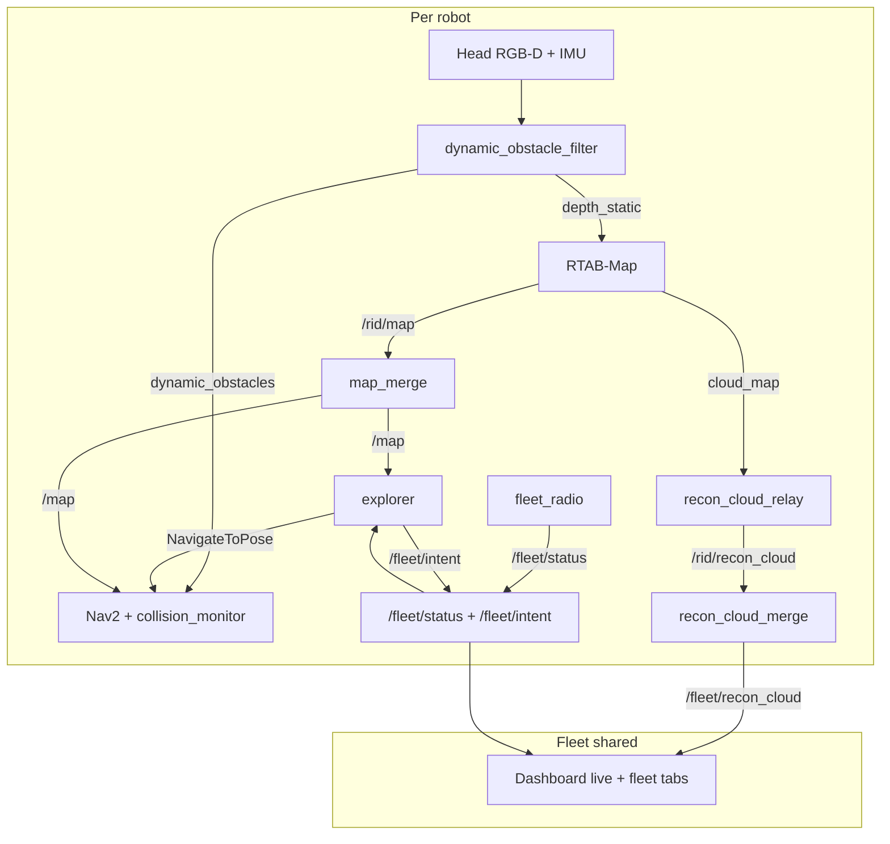

# Perception, exploration, and fleet fusion

Architecture reference for the Isaac Sim + ROS 2 Jazzy track. For how to
**run** scenarios, see [`docs/running.md`](running.md). Entry point for sims:
`scripts/sim_ctl.sh` (see `.claude/skills/sim-run/SKILL.md`).

This is **not** a colcon package tree: nodes are loose scripts under `nodes/`,
launched by path from `launch/sortbots_bringup.launch.py`. Tuning is plain
YAML loaded by each node (not ROS params), except Nav2 which uses
`configs/nav2_params.yaml`.

---

## Big picture



**Collaborative fusion, not collaborative SLAM.** Each robot owns its own
RTAB-Map database and pose graph. The fleet shares a fused 2D `/map` and a
fused 3D `/fleet/recon_cloud` by transforming into a world `map` frame with
**known spawn anchors** (`configs/robots.yaml`). There is no shared pose
graph and no inter-robot loop closure.

---

## Perception (per robot)

### Sensors (Isaac → ROS 2)

Published by `scripts/spawn_warehouse.py` under `/{robot_id}/`:

| Topic | Role |
|---|---|
| `camera/rgb`, `camera/depth`, `camera/camera_info` | Head D435-style RGB-D (SLAM + Nav2) |
| `imu` | MPU6050-style; RTAB-Map waits for first sample |
| `odom` + TF `odom → base_link` | Motion prior (`visual_odometry:=false`) |
| `camera/chase/*` | Optional cosmetic 3rd-person cam (fleet default: first N robots only) |

TF frames are **prefixed** (`robot_0/base_link`, …) on the **shared** `/tf`.
Autonomy must **not** look up other robots’ poses on `/tf` for coordination
(that would be a pose oracle). Self-reported `/fleet/status` is the radio
channel instead.

### Dynamic obstacle filter

[`nodes/dynamic_obstacle_filter.py`](../nodes/dynamic_obstacle_filter.py)

| Output | Consumer |
|---|---|
| `/{id}/camera/depth_static` | RTAB-Map (movers → NaN so they are not painted into SLAM) |
| `/{id}/dynamic_obstacles` | Nav2 ephemeral `ObstacleLayer` source |

Detection v1: frame-to-frame depth change, morph close, keep robot-sized
blobs. Vision-only — no peer TF. Bringup starts this **before** RTAB-Map so
`depth_static` exists when mapping starts.

### RTAB-Map

[`launch/sortbots_rtabmap_robot.launch.py`](../launch/sortbots_rtabmap_robot.launch.py)

- One instance per robot; `map_frame_id` = `{robot_id}/map`
- Depth input = `depth_static` (filtered)
- Occupancy tuning in `GRID_ARGS` (`Grid/3D`, `RayTracing`, `RangeMax`, …) —
  see “Occupancy-grid tuning” in `docs/running.md`
- Publishes `/{id}/map` (2D grid) and `cloud_map` (3D assembled cloud)

### Recon cloud relay

[`nodes/recon_cloud_relay.py`](../nodes/recon_cloud_relay.py)

- `/{id}/cloud_map` → budgeted `/{id}/recon_cloud` (hard point cap, packed
  `point_step`, keepalive for rosbridge)
- Keeps the browser and rosbridge from choking on unbounded clouds

### Nav2 (local avoidance)

[`configs/nav2_params.yaml`](../configs/nav2_params.yaml),
[`launch/sortbots_nav2.launch.py`](../launch/sortbots_nav2.launch.py)

- Global frame = fused `/map`; local + global costmaps use
  `depth_static/points` + `dynamic_obstacles`
- MPPI DiffDrive + reactive BT (`configs/bt/navigate_to_pose_reactive.xml`)
- `collision_monitor` after velocity smoother (last-resort stop)
- **Not** multi-agent path planning: peers are anonymous dynamic obstacles
  when seen in depth, plus soft keepouts from mesh intent/status

---

## Exploration

[`nodes/explorer.py`](../nodes/explorer.py), config
[`configs/explorer.yaml`](../configs/explorer.yaml)

Frontier-based autonomous mapping against the **fused** `/map` by default
(space *any* robot has mapped). Drives Nav2 `navigate_to_pose`.

Notable behaviors (see also `docs/running.md` “Autonomous exploration”):

- Score frontiers by size / distance / openness; standoff goals in free space
- Blacklist with escalating strikes / TTL
- Operator **steer** hints (`explore_hint`) and nav-goal arbitration with
  task_manager
- Escape / backtrack / stuck watchdog / startup spin

### Multi-robot exploration coordination (mesh)

Replaces the old `/explore/claims` + TF peer lookups:

| Topic | Publisher | Use |
|---|---|---|
| `/fleet/intent` | explorer | Goal + corridor polyline + priority; soft exclusion + yield |
| `/fleet/status` | [`nodes/fleet_radio.py`](../nodes/fleet_radio.py) | Self-reported pose/twist/mode for peer keepouts |

Config: [`configs/fleet_radio.yaml`](../configs/fleet_radio.yaml).

- **No peer TF oracle** in explorer (`_peer_positions` reads status only)
- Lower `priority` wins courtesy yield when corridors conflict (`robot_0` = 0)
- Sim transport = shared ROS topics (WiFi mesh stand-in); schema is
  mesh-shaped for a later real radio adapter

---

## Fleet fusion

Bringup publishes a static `map → {robot_id}/map` from
[`configs/robots.yaml`](../configs/robots.yaml) spawn poses. Both fusion
nodes use those anchors.

### 2D map merge

[`nodes/map_merge.py`](../nodes/map_merge.py) + [`nodes/map_fuse.py`](../nodes/map_fuse.py)

- Inputs: `/{id}/map`
- Output: `/map` (occupied > free > unknown), plus `/map_anchors` for the UI
- Nav2 and explorers consume `/map`

### 3D recon merge

[`nodes/recon_cloud_merge.py`](../nodes/recon_cloud_merge.py) +
[`nodes/recon_fuse.py`](../nodes/recon_fuse.py)

- Inputs: `/{id}/recon_cloud` (frame `{id}/map`)
- Output: `/fleet/recon_cloud` (frame `map`), re-budgeted
- Dashboard 3D panel subscribes here (label `fleet · N vox`)

| What | Fusion | Collaborative SLAM |
|---|---|---|
| Shared occupancy / cloud | Yes (anchors) | No |
| Shared pose graph / loop closure | No | Would need a different stack |

Optional later: map-to-map ICP when robots overlap, still without a joint graph.

---

## Dashboard

Served by `webui/serve.py` (console: `scripts/run_console.sh` →
http://localhost:8081/).

| Tab | Role |
|---|---|
| **live** | Cameras / fused 2D map / drive / dispatch / 3D fleet recon |
| **fleet** | Monitor `/fleet/status` + `/fleet/intent` ([`webui/fleet_comms.js`](../webui/fleet_comms.js)) |
| **scenarios** | Start/stop sims via HTTP control API ([`webui/scenarios.js`](../webui/scenarios.js)) |

Peer markers on the live map/3D view also prefer `/fleet/status` (same radio
as autonomy), not TF eavesdropping.

---

## Key files

| Path | Role |
|---|---|
| `launch/sortbots_bringup.launch.py` | Per-robot stack + map/recon merge + fleet radio |
| `launch/sortbots_rtabmap_robot.launch.py` | RTAB-Map + depth_static remaps |
| `launch/sortbots_nav2.launch.py` | Nav2 + depth_static points + collision_monitor |
| `configs/robots.yaml` | Roster + spawn poses (= fusion anchors) |
| `configs/scenarios/explore_fleet.yaml` | 2-robot explore preset |
| `configs/map_merge.yaml` / `recon_merge.yaml` / `fleet_radio.yaml` | Fusion / radio tuning |
| `tests/map_merge_test.py` / `recon_merge_test.py` / `fleet_radio_test.py` / `dynamic_obstacle_filter_test.py` | Offline unit tests |

---

## Offline checks

```bash
/usr/bin/python3 -m pytest tests/map_merge_test.py tests/recon_merge_test.py \
  tests/fleet_radio_test.py tests/dynamic_obstacle_filter_test.py -q
node webui/tests/scenarios_test.mjs   # includes fleet tab visibility
```

## Live checks (headless fleet)

```bash
scripts/sim_ctl.sh console start
scripts/sim_ctl.sh start explore_fleet headless=true
scripts/sim_ctl.sh wait running --timeout 420
```

Then open http://localhost:8081/ (hard-reload):

- **map** stage → “Fused fleet map (N robots) · W×H”
- **3D** → `fleet · N vox` on `/fleet/recon_cloud`
- **fleet** tab → status cards + intent + radio log

```bash
# system ROS shell, not Isaac/conda
ros2 topic echo /map --once
ros2 topic echo /fleet/recon_cloud --once   # frame_id should be map
ros2 topic hz /fleet/status
```
